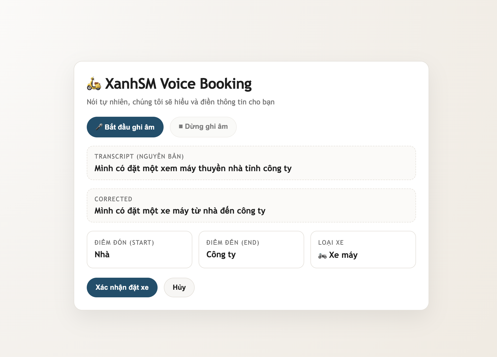

# 🎤 AI Voice Booking (MVP Hackathon)



## 🚀 Tổng quan

Đây là một **prototype mobile (React Native)** cho phép người dùng **đặt xe bằng giọng nói**.

Người dùng chỉ cần nói một câu như:
👉 *“Đặt xe về nhà”*

Hệ thống sẽ:

1. Ghi âm giọng nói
2. Chuyển thành văn bản (Speech-to-Text)
3. Phân tích ý định (đi đâu, phương tiện)
4. Tự động điền form đặt xe
5. Người dùng xác nhận để hoàn tất

🎯 Mục tiêu: giảm thời gian đặt xe từ **30–60s xuống <5s**

---

## ✨ Tính năng chính

* 🎤 Ghi âm từ microphone (mobile)
* 📝 Hiển thị nội dung nói (transcript)
* 🧠 Phân tích đơn giản (Home / Work / Vehicle)
* 📍 Tự động điền điểm đến
* 🚗 Gợi ý phương tiện (Car / Bike)
* ✅ Xác nhận trước khi đặt (tránh sai)
* ✏️ Cho phép chỉnh sửa thủ công

---

## 🧠 Cách hệ thống hoạt động

```text
User nói → Ghi âm → Speech-to-Text → Parse intent → Auto-fill form → User confirm
```

Chi tiết:

1. User bấm nút 🎤 và nói
2. App ghi âm bằng `expo-av`
3. Gửi audio → API chuyển giọng nói thành text
4. Text → parser (AI / rule-based)
5. Trả về:

   * Điểm đi (From)
   * Điểm đến (To)
   * Phương tiện (Vehicle)
6. UI hiển thị → user xác nhận

---

## 📦 Tech stack

* React Native (Expo)
* `expo-av` (ghi âm)
* Speech-to-Text (Whisper / Google / mock)
* Parser đơn giản (keyword-based)

---

## 🎤 Ghi âm (Audio Recording)

```js
import { Audio } from 'expo-av';

const recording = new Audio.Recording();
await recording.prepareToRecordAsync(
  Audio.RecordingOptionsPresets.HIGH_QUALITY
);
await recording.startAsync();
```

Sau khi dừng:

```js
await recording.stopAndUnloadAsync();
const uri = recording.getURI();
```

👉 `uri` là file audio được ghi từ **microphone của thiết bị**

---

## 🔄 Voice → Text → AI

1. Ghi âm → lấy file audio
2. Gửi đến Speech-to-Text
3. Nhận lại text
4. Parse thành dữ liệu:

```json
{
  "from": "Vị trí hiện tại",
  "to": "Nhà",
  "vehicle": "Xe máy"
}
```

---

## 🧩 Logic MVP (đơn giản)

* “nhà” → Home
* “công ty” → Work
* “xe máy” → Bike
* “ô tô” → Car

Fallback:

* Thiếu phương tiện → gợi ý chọn
* Không rõ điểm đến → user nhập tay

---

## 🖥 Hành vi UI

* Hiển thị **transcript** để user thấy AI nghe gì
* Auto-fill form:

  * From (GPS)
  * To (Home / Work)
  * Vehicle
* Luôn có bước **Confirm**
* Cho phép user sửa trước khi đặt

---

## ⚠️ Edge cases xử lý trong MVP

* Tiếng ồn → user nói lại
* Thiếu thông tin → hỏi / gợi ý
* Mơ hồ → hiển thị lựa chọn
* Sai → user sửa
* Không có xe → gợi ý loại khác

---

## 🎯 Phạm vi MVP

### Có

* Voice recording
* Transcription
* Parse đơn giản
* Auto-fill + confirm

### Chưa có (future)

* NLP nâng cao
* Multi-turn conversation
* Ranking địa điểm (quán ăn, POI)
* Cá nhân hóa nâng cao

---

## 🏁 Chạy project

```bash
npm install
npx expo start
```

👉 Nhớ cấp quyền microphone khi chạy app

---

## 🎤 Demo flow (trình bày hackathon)

1. Bấm “Start Voice”
2. Nói: *“Đặt xe về nhà”*
3. Hiển thị transcript
4. Form tự điền
5. Nhấn “Confirm”
6. Hiện popup thành công 🎉

---

## 💡 Insight quan trọng

> Đây là **AI augmentation**, không phải automation.
> User luôn xác nhận → tránh đặt nhầm (cost cao).

---

## 👥 Team

Nhom_01_E402
